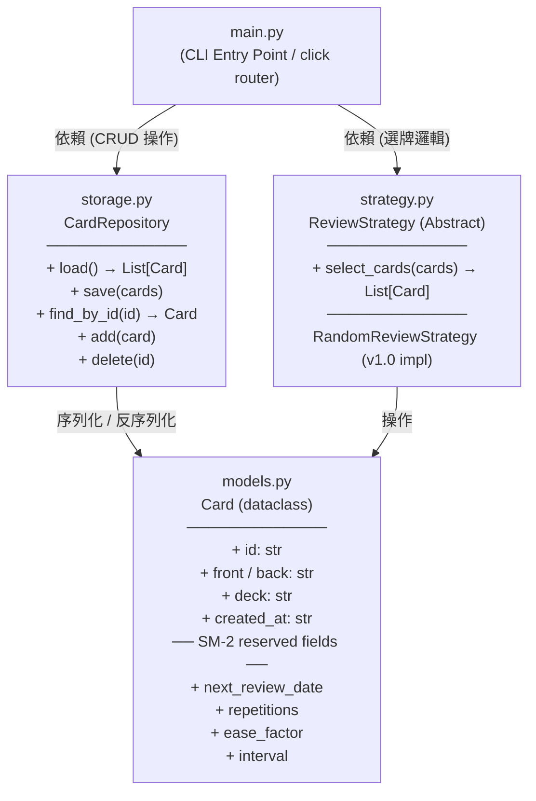

# SDD v1.0 — `fc` Flashcard CLI Tool（改進版）

> **版本：** 1.0.0 | **最後更新：** 2026-03-16
 
---
 
## 1. 專案概覽（Project Overview）
 
| 欄位 | 內容 |
|------|------|
| **程式名稱** | `fc` (Flashcard CLI) |
| **版本** | v1.0 |
| **Elevator Pitch** | 一個純 CLI 的字卡複習工具，讓開發者無需離開終端機即可完成每日記憶訓練。 |
| **目標使用者** | 偏好鍵盤驅動工作流程的開發者、學生，以及需要高效背誦知識的技術人員。 |
| **核心價值** | 零依賴圖形介面、資料本地化儲存、架構為間隔重複演算法 (SM-2) 升級預先設計，確保 v1.0 至 v2.0 的平滑遷移路徑。 |
 
---
 
## 2. CLI 介面規格（Interface Specification）
 
所有指令均以 `fc` 作為根指令，採 **click 子指令風格 (subcommand style)** 設計。
 
### 2.1 指令總覽
 
| 子指令 | 必填參數 | 選填參數 | 說明 |
|--------|----------|----------|------|
| `add` | `--front TEXT` `--back TEXT` | `--deck TEXT` | 新增一張字卡至指定牌組（預設牌組：`default`）。 |
| `list` | — | `--deck TEXT` | 列出所有字卡，可依牌組篩選。以表格格式輸出 ID、正面、背面、建立時間。 |
| `review` | — | `--deck TEXT` `--limit INT` | 開始互動式複習循環。`--limit` 限制本次複習張數（預設：不限）。 |
| `delete` | `--id TEXT` | — | 依 ID 刪除指定字卡。操作前輸出確認提示，除非加上 `--yes` 旗標。 |
 
### 2.2 各子指令詳細規格
 
#### `fc add`
 
```
fc add --front TEXT --back TEXT [--deck TEXT]
```
 
- 成功時輸出：`✓ Card added (id: <uuid>)`
- `--front` 與 `--back` 均為必填；缺少任一項時觸發 click 的 `MissingParameter` 錯誤並以 Exit Code `2` 結束。
 
#### `fc list`
 
```
fc list [--deck TEXT]
```
 
- 以欄位對齊的表格輸出所有字卡，欄位為：`ID`、`Front`、`Back`、`Created At`。
- 若資料庫中無任何字卡，輸出：`No cards found.`
 
#### `fc review`
 
```
fc review [--deck TEXT] [--limit INT]
```
 
**互動式複習流程（每張字卡）：**
 
```
[Card 1 / 5]
━━━━━━━━━━━━━━━━━━━━━━━━━━
FRONT: <正面文字>
━━━━━━━━━━━━━━━━━━━━━━━━━━
Press [Enter] to reveal answer...
 
BACK: <背面文字>
━━━━━━━━━━━━━━━━━━━━━━━━━━
Rate your recall (1=Forgot → 5=Perfect): _
```
 
| 評分值 | 語意 |
|--------|------|
| `1` | 完全忘記 |
| `2` | 很難想起 |
| `3` | 勉強想起 |
| `4` | 稍有遲疑但正確 |
| `5` | 完美記住 |
 
- 輸入非 1–5 的值時，重新提示輸入，不中斷流程。
- 所有卡片複習完畢後輸出摘要：`Session complete. Reviewed: N cards.`

##### `review` 互動狀態機

```mermaid
stateDiagram-v2
    [*] --> SelectCards: fc review 開始
    SelectCards --> ShowFront: 按 --limit 和 --deck<br/>隨機選卡
    ShowFront --> WaitEnter: 顯示卡片正面<br/>[Card N / M]
    WaitEnter --> ShowBack: 用戶按 Enter
    ShowBack --> WaitScore: 顯示卡片背面
    WaitScore --> ValidateScore{評分 1–5？}
    ValidateScore -->|有效（1–5）| NextCard{更多卡片？}
    ValidateScore -->|無效（0,6,abc等）| InvalidPrompt[輸出錯誤提示<br/>Invalid input...]
    InvalidPrompt --> WaitScore: 重新提示，不中斷
    NextCard -->|是| ShowFront: 移至下一張卡
    NextCard -->|否| Summary[輸出摘要<br/>Session complete...]
    Summary --> [*]: 結束，Exit Code 0
    
    WaitEnter -.Ctrl+C.-> Interrupt[輸出中斷訊息<br/>Review interrupted.]
    WaitScore -.Ctrl+C.-> Interrupt
    Interrupt --> [*]: 結束，Exit Code 0
```

**詳細互動步驟表**：

| 步驟 | 觸發事件 | 預期行為 | 說明 |
|------|----------|----------|------|
| 1 | 執行 `fc review [--deck D] [--limit N]` | 從資料庫選卡 | 若 `--deck` 未指定，選所有牌組；若 `--limit` 未指定或為 None，選所有符合卡片 |
| 2 | （內部邏輯） | 若選中卡片為 0 張 | 直接輸出 `Session complete. Reviewed: 0 cards.`（Exit 0）並結束 |
| 3 | 顯示第 i 張卡 | 輸出格式 | `[Card i / N]` + 分割線 + `FRONT: <文字>` + 分割線 + `Press [Enter]...` |
| 4 | 用戶按 Enter | 不驗證，立即顯示背面 | 無任何提示訊息，直接進入背面顯示 |
| 5 | 顯示背面 | 輸出格式 | 背面文字 + 分割線 + `Rate your recall (1=Forgot → 5=Perfect): ` |
| 6 | 用戶輸入 1–5 | 視為有效評分 | 記錄評分（v1.0 不做任何計算，v2.0 會用於 SM-2） |
| 6a | 用戶輸入非 1–5（0, 6, abc 等） | 輸出錯誤訊息 | `Invalid input. Please enter a number between 1 and 5.`，**不中斷流程**，回到步驟 5 重新提示 |
| 7 | 所有卡片完成評分 | 輸出摘要 | `Session complete. Reviewed: <n> cards.`（n = 實際複習數）+ Exit Code 0 |
| 8 | 用戶在任何步驟按 Ctrl+C | 中斷複習 | 輸出 `Review interrupted.`，不輸出已複習數，Exit Code 0 |

 
#### `fc delete`
 
```
fc delete --id TEXT [--yes]
```
 
- 不加 `--yes` 時，輸出確認提示：`Delete card <id>? [y/N]:`
- 成功時輸出：`✓ Card <id> deleted.`
- ID 不存在時，輸出錯誤訊息並以 Exit Code `1` 結束。
 
---
 
## 3. 資料模型（Data Model）
 
### 3.1 `Card` 物件欄位定義
 
| 欄位名稱 | 型別 | 預設值 | 說明 |
|----------|------|--------|------|
| `id` | `str` (UUID v4) | `uuid4()` 自動生成 | 字卡唯一識別碼，RFC 4122 標準小寫格式（e.g. `a1b2c3d4-e5f6-7890-abcd-ef1234567890`）。 |
| `front` | `str` | 必填 | 字卡正面內容（問題 / 提示）。 |
| `back` | `str` | 必填 | 字卡背面內容（答案 / 解釋）。 |
| `deck` | `str` | `"default"` | 所屬牌組名稱，供未來多牌組管理使用。 |
| `created_at` | `str` (ISO 8601) | `datetime.utcnow()` | 字卡建立時間戳，格式：`YYYY-MM-DDTHH:MM:SSZ`。 |
| `next_review_date` | `str` \| `null` (ISO 8601) | `null` | **(v1.0 預先保留，供未來演算法升級使用)** SM-2 排程的下次複習日期。v1.0 中不參與複習邏輯判斷。 |
| `repetitions` | `int` | `0` | **(v1.0 預先保留，供未來演算法升級使用)** 連續答對次數，SM-2 演算法核心計數器。 |
| `ease_factor` | `float` | `2.5` | **(v1.0 預先保留，供未來演算法升級使用)** 簡單度因子，SM-2 預設值為 2.5，範圍 [1.3, ∞)。 |
| `interval` | `int` | `0` | **(v1.0 預先保留，供未來演算法升級使用)** 距下次複習的間隔天數，SM-2 計算結果。 |
 
### 3.2 儲存格式範例（JSON）
 
資料儲存於 `~/.fc/cards.json`，結構如下：
 
```json
{
  "cards": [
    {
      "id": "a1b2c3d4-e5f6-7890-abcd-ef1234567890",
      "front": "What is a Python decorator?",
      "back": "A function that wraps another function to extend its behavior.",
      "deck": "python",
      "created_at": "2026-03-16T08:00:00Z",
      "next_review_date": null,
      "repetitions": 0,
      "ease_factor": 2.5,
      "interval": 0
    }
  ]
}
```

### 3.3 初始化與資料一致性

#### 目錄與檔案初始化

- **首次執行**：若 `~/.fc/` 目錄或 `cards.json` 不存在，程式自動建立。
  - 若無寫入權限，報 Error E05 並 Exit Code 1。
  
- **JSON 初始狀態**：首次建立的 `cards.json` 應包含：
  ```json
  { "cards": [] }
  ```

#### 牌組預設行為

- **fc list 無 --deck 參數**：列出資料庫**所有牌組**的卡片（合併視圖）。
  
- **fc review 無 --deck 參數**：從資料庫**所有牌組**隨機選卡。
  
- **fc add 無 --deck 參數**：新增至 `default` 牌組。
  
- **牌組不存在**：
  - `fc list --deck nonexistent` → 輸出 `No cards found.`（Exit 0，非 Error）
  - `fc review --deck nonexistent` → 輸出 `Session complete. Reviewed: 0 cards.`（Exit 0）
  - `fc add --deck newdeck ...` → 自動建立 `newdeck` 牌組

#### 資料一致性保證

- **原子性寫入**：所有修改操作（add, delete）應先寫入臨時檔案 `cards.json.tmp`，再原子性重命名為 `cards.json`，防止 Ctrl+C 導致的資料損毀。
  
- **讀取失敗**：若 `cards.json` 無法被正確解析（JSON 格式錯誤），報 Error E03 並 Exit Code 1。

#### UUID 格式規範

- **格式**：RFC 4122 標準 UUID v4，小寫，含連字號（e.g. `a1b2c3d4-e5f6-7890-abcd-ef1234567890`）。
  
- **驗證**：v1.0 中 `fc delete --id <uuid>` 無格式驗證，假設所有既存 ID 為合法 UUID。v2.0 可酌情新增驗證。

 
---
 
## 4. 模組架構（Module Design）
 
### 4.1 目錄結構
 
```
fc/
├── main.py          # CLI 進入點，click command router
├── models.py        # 資料模型定義 (dataclass / pydantic)
├── storage.py       # Repository Pattern：JSON 讀寫抽象層
├── strategy.py      # Strategy Pattern：複習演算法抽象介面與實作
└── __init__.py
```
 
### 4.2 模組關聯圖（Mermaid）
 

 
### 4.3 策略模式說明（Strategy Pattern）
 
`strategy.py` 定義抽象基底類別 `ReviewStrategy`，所有複習演算法均須實作 `select_cards()` 介面。v1.0 提供唯一實作 `RandomReviewStrategy`（隨機抽卡）。v2.0 升級時，只需新增 `SM2ReviewStrategy` 並注入 `main.py` 的 `review` 指令，**不需修改任何現有邏輯**，符合開放封閉原則（OCP）。
 
```
ReviewStrategy (ABC)
    └── select_cards(cards: List[Card], limit: int) → List[Card]
            ↑
            │ implements
            ├── RandomReviewStrategy      ← v1.0 使用
            └── SM2ReviewStrategy         ← v2.0 預計實作
```
 
### 4.4 倉儲模式說明（Repository Pattern）
 
`storage.py` 的 `CardRepository` 封裝所有 JSON I/O 邏輯，對上層（`main.py`）提供純粹的 domain-level CRUD 介面。若 v2.0 需要遷移至 SQLite 或其他後端，只需替換 `CardRepository` 的實作，CLI 層無需任何改動。
 
---
 
## 5. 錯誤處理規格（Error Handling）
 
| # | 錯誤情境 | 觸發條件 | 輸出訊息（stderr） | Exit Code |
|---|----------|----------|--------------------|-----------|
| E01 | **字卡 ID 不存在** | `fc delete --id <不存在的 UUID>` 或內部查詢失敗 | `Error: Card with id '<id>' not found.` | `1` |
| E02 | **必填參數缺失** | `fc add` 未提供 `--front` 或 `--back` | `Error: Missing option '--front' / '--back'.`（由 click 原生處理） | `2` |
| E03 | **JSON 檔案損毀** | `cards.json` 存在但無法被正確解析（非合法 JSON） | `Error: Data file is corrupted. Please inspect ~/.fc/cards.json.` | `1` |
| E04 | **評分輸入超出範圍** | `fc review` 互動中輸入非 1–5 整數 | `Invalid input. Please enter a number between 1 and 5.`（不中斷流程，重新提示） | N/A（繼續執行） |
| E05 | **資料目錄無寫入權限** | `~/.fc/` 目錄存在但程式無寫入權限 | `Error: Permission denied when writing to ~/.fc/cards.json.` | `1` |
 
---
 
## 6. 測試案例（Test Cases）
 
以下測試案例為 v1.0 **向下相容性的嚴格驗收標準**，任何後續版本均不得破壞這些行為。

### 6.1 標準功能測試

| # | 輸入指令 | 前置狀態 | 預期輸出（stdout / stderr） | 預期 Exit Code |
|---|----------|----------|-----------------------------|----------------|
| T01 | `fc add --front "OSI 第 7 層" --back "應用層 (Application Layer)"` | 資料庫為空或已有資料 | `✓ Card added (id: <uuid>)` | `0` |
| T02 | `fc list` | 資料庫中已有至少一張字卡（由 T01 新增） | 以表格格式輸出所有字卡，欄位包含 `ID`、`Front`、`Back`、`Created At`，且正面文字包含 `OSI 第 7 層` | `0` |
| T03 | `fc list` | 資料庫完全為空 | `No cards found.` | `0` |
| T04 | `fc review --limit 1` | 資料庫中已有至少一張字卡 | 依序印出：正面文字 → 等待 Enter → 背面文字 → 評分提示 `Rate your recall (1=Forgot → 5=Perfect):`；輸入 `3` 後輸出 `Session complete. Reviewed: 1 cards.` | `0` |
| T05 | `fc delete --id <不存在的 UUID> --yes` | 任意狀態 | stderr 輸出：`Error: Card with id '<uuid>' not found.` | `1` |

### 6.2 邊界情況與異常流程

下列邊界測試案例為 **v2.0 向下相容性驗證的嚴格標準**，任何後續版本均不得破壞。

| # | 輸入指令 | 前置狀態 | 預期輸出（stdout / stderr） | Exit Code |
|---|----------|----------|-----------------------------|-----------|
| T06 | `fc list --deck nonexistent_deck` | 資料庫中無 `nonexistent_deck` 牌組 | `No cards found.`（視同空查詢，非 Error） | `0` |
| T07 | `fc review --limit 0` | 資料庫有至少 1 張卡 | `Session complete. Reviewed: 0 cards.` | `0` |
| T08 | `fc review --limit 1000` | 資料庫只有 5 張卡 | 複習 5 張（實際存有），摘要輸出 `Session complete. Reviewed: 5 cards.` | `0` |
| T09 | `fc delete --id <valid-id>` 執行成功後，再執行 `fc delete --id <same-id> --yes` | 同一個有效 ID 刪除兩次 | 第二次報錯：`Error: Card with id '<id>' not found.`（stderr） | `1` |
| T10 | `fc review --limit 2` 在評分步驟後按 Ctrl+C | 複習進行中，已顯示至少一張卡的背面 | `Review interrupted.`（stdout）+ 換行後結束程式 | `0` |

**補充說明**：

- **T06**：牌組不存在時的預設行為是「No cards found」而非報錯，確保符合 `fc list` 的設計。
- **T07–T08**：`--limit` 的邊界值（0 和超額）需明確定義，以便 v2.0 實現相同邏輯。
- **T09**：二次刪除同一 ID 的行為，驗證 delete 操作的冪等性（idempotency）。
- **T10**：Ctrl+C 中斷時的優雅結束方式，確保 v2.0 處理方式一致。
