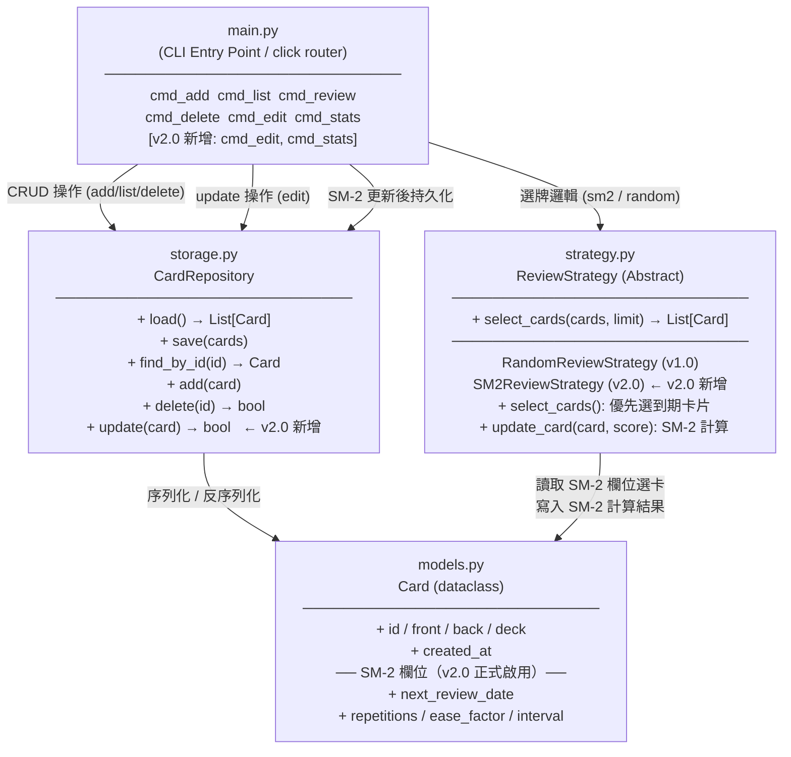
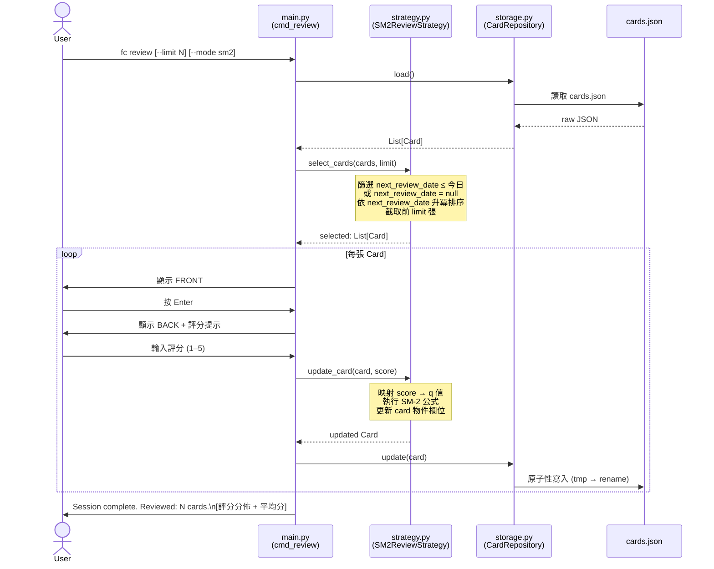

# SDD v2.0 — `fc` Flashcard CLI Tool

> **文件狀態：** 正式發佈 | **版本：** 2.0.0 | **最後更新：** 2026-03-26
> **基於：** SDD v1.0.0 | **向下相容：** 完整保留 v1.0 全部介面與測試案例 T01–T10

---

## 目錄

1. [專案概覽](#1-專案概覽project-overview)
2. [CLI 介面規格](#2-cli-介面規格interface-specification)
3. [資料模型](#3-資料模型data-model)
4. [模組架構](#4-模組架構module-design)
5. [錯誤處理規格](#5-錯誤處理規格error-handling)
6. [測試案例](#6-測試案例test-cases)
7. [向下相容性設計](#7-向下相容性設計backward-compatibility)

---

## 1. 專案概覽（Project Overview）

| 欄位 | 內容 |
|------|------|
| **程式名稱** | `fc` (Flashcard CLI) |
| **版本** | v2.0 |
| **Elevator Pitch** | 一個純 CLI 的字卡複習工具，v2.0 正式啟用 SM-2 間隔重複演算法，讓每次複習都發生在遺忘曲線的最佳時機點。 |
| **目標使用者** | 偏好鍵盤驅動工作流程的開發者、學生，以及需要長期維持知識記憶的技術人員。 |
| **核心價值** | 以最小架構變動完成 v1.0 → v2.0 演化：啟用 SM-2 智慧排程、字卡編輯、場次統計摘要、全域學習狀況一覽，同時 100% 向下相容 v1.0 全部測試案例。 |

### 1.1 v1.0 → v2.0 變更摘要

| 面向 | v1.0 | v2.0 |
|------|------|------|
| 複習演算法 | `RandomReviewStrategy`（隨機） | `SM2ReviewStrategy`（預設）；`RandomReviewStrategy` 保留 |
| SM-2 欄位 | 預先保留，值不更新 | 每次複習後即時更新並寫回 JSON |
| 字卡編輯 | 不支援 | 新增 `fc edit` |
| 場次摘要 | 僅顯示複習數量 | 附加評分分佈與平均分 |
| 全域統計 | 不支援 | 新增 `fc stats` |
| 新增模組 | — | 無新增模組（僅擴充既有模組）|

---

## 2. CLI 介面規格（Interface Specification）

所有指令均以 `fc` 作為根指令，採 **click 子指令風格 (subcommand style)** 設計。

### 2.1 指令總覽

| 子指令 | 必填參數 | 選填參數 | 版本 | 說明 |
|--------|----------|----------|------|------|
| `add` | `--front TEXT` `--back TEXT` | `--deck TEXT` | v1.0 ✅ | 新增一張字卡至指定牌組。 |
| `list` | — | `--deck TEXT` | v1.0 ✅ | 列出所有字卡，可依牌組篩選。 |
| `review` | — | `--deck TEXT` `--limit INT` `--mode [sm2\|random]` | v1.0 ✅ (擴充) | 開始互動式複習循環，預設採 SM-2 排程選卡。 |
| `delete` | `--id TEXT` | `--yes` | v1.0 ✅ | 依 ID 刪除字卡。 |
| `edit` | `--id TEXT` | `--front TEXT` `--back TEXT` `--deck TEXT` | **v2.0 新增** | 修改既有字卡的內容，不重置 SM-2 欄位。 |
| `stats` | — | `--deck TEXT` | **v2.0 新增** | 顯示牌組的全域學習統計。 |

### 2.2 各子指令詳細規格

#### `fc add`（v1.0 介面凍結，行為不變）

```
fc add --front TEXT --back TEXT [--deck TEXT]
```

- 成功時輸出：`✓ Card added (id: <uuid>)`
- `--front` 與 `--back` 均為必填；缺少任一項時觸發 click 的 `MissingParameter` 錯誤並以 Exit Code `2` 結束。

#### `fc list`（v1.0 介面凍結，行為不變）

```
fc list [--deck TEXT]
```

- 以欄位對齊的表格輸出所有字卡，欄位為：`ID`、`Front`、`Back`、`Created At`。
- 若資料庫中無任何字卡，輸出：`No cards found.`

#### `fc review`（v1.0 介面相容，新增 `--mode` 選項）

```
fc review [--deck TEXT] [--limit INT] [--mode {sm2,random}]
```

**新增選項 `--mode`：**

| 值 | 說明 |
|----|------|
| `sm2`（預設） | 採 `SM2ReviewStrategy`：優先選取今日到期（`next_review_date` ≤ 今日）或從未複習（`next_review_date` 為 null）的卡片。複習後更新 SM-2 欄位並寫回 JSON。 |
| `random` | 採 `RandomReviewStrategy`（v1.0 行為）：從所有符合條件的卡片中隨機選取，**不**更新 SM-2 欄位。 |

**互動式複習流程（每張字卡，行為與 v1.0 相同）：**

```
[Card 1 / 5]
━━━━━━━━━━━━━━━━━━━━━━━━━━
FRONT: <正面文字>
━━━━━━━━━━━━━━━━━━━━━━━━━━
Press [Enter] to reveal answer...

BACK: <背面文字>
━━━━━━━━━━━━━━━━━━━━━━━━━━
Rate your recall (1=Forgot → 5=Perfect): _
```

**v2.0 複習結束摘要格式（複習 N > 0 張時）：**

```
Session complete. Reviewed: N cards.

Score Distribution:
  1 (Forgot)  : ██░░░░░░░░  2
  2 (Hard)    : ░░░░░░░░░░  0
  3 (Okay)    : ███░░░░░░░  1
  4 (Good)    : ████░░░░░░  1
  5 (Perfect) : █████░░░░░  1
Average Score : 2.8
```

- 第一行 `Session complete. Reviewed: N cards.` **完全不變**，確保 v1.0 測試案例 T04 通過。
- 統計資訊附加於第一行之後，以一個空行分隔。
- `--limit 0` 或無到期卡片（N = 0）時，**僅輸出** `Session complete. Reviewed: 0 cards.`，不附加統計資訊（完全相容 v1.0 T07）。
- `--mode random` 時，統計摘要格式相同，但不更新 SM-2 欄位。

**SM-2 評分對應規則（`--mode sm2`）：**

| 使用者輸入（1–5） | SM-2 品質參數 q | 語意 |
|:---:|:---:|------|
| `1` | `0` | 完全忘記，重置排程 |
| `2` | `1` | 很難想起，重置排程 |
| `3` | `2` | 勉強想起，重置排程（q < 3 視為未通過） |
| `4` | `3` | 稍有遲疑，通過，間隔正常遞增 |
| `5` | `5` | 完美記住，通過，間隔大幅遞增 |

**SM-2 更新邏輯（複習後寫回 JSON）：**

```
若 q < 3（評分 1, 2, 3）：
    repetitions = 0
    interval = 1
    next_review_date = 今日 + 1 天

若 q >= 3（評分 4, 5）：
    若 repetitions == 0：interval = 1
    若 repetitions == 1：interval = 6
    否則：interval = round(interval × ease_factor)
    ease_factor = max(1.3, ease_factor + 0.1 - (5 - q) × (0.08 + (5 - q) × 0.02))
    repetitions += 1
    next_review_date = 今日 + interval 天
```

#### `fc delete`（v1.0 介面凍結，行為不變）

```
fc delete --id TEXT [--yes]
```

- 不加 `--yes` 時，輸出確認提示：`Delete card <id>? [y/N]:`
- 成功時輸出：`✓ Card <id> deleted.`
- ID 不存在時，輸出錯誤訊息並以 Exit Code `1` 結束。

#### `fc edit`（v2.0 新增）

```
fc edit --id TEXT [--front TEXT] [--back TEXT] [--deck TEXT]
```

- `--id` 為必填；`--front`、`--back`、`--deck` 三者至少提供其一，否則以 Exit Code `2` 結束並輸出：`Error: At least one of --front, --back, --deck must be provided.`（輸出至 stderr）。
- 成功修改後輸出：`✓ Card <id> updated.`
- ID 不存在時，輸出 `Error: Card with id '<id>' not found.`（stderr），Exit Code `1`。
- **不重置** `repetitions`、`ease_factor`、`interval`、`next_review_date` 等 SM-2 欄位。

#### `fc stats`（v2.0 新增）

```
fc stats [--deck TEXT]
```

- 不指定 `--deck` 時，輸出所有牌組的統計資訊。
- 指定 `--deck` 時，僅輸出該牌組統計資訊；牌組不存在時，輸出 `No stats available.`（Exit Code `0`）。
- 資料庫無任何卡片時，輸出 `No stats available.`（Exit Code `0`）。

**輸出格式範例：**

```
Deck         Cards  Due Today  Avg Ease
──────────── ─────  ─────────  ────────
default          3          2      2.50
python           5          1      2.73
──────────── ─────  ─────────  ────────
Total            8          3      2.64
```

欄位說明：

| 欄位 | 計算方式 |
|------|----------|
| `Cards` | 該牌組的卡片總數 |
| `Due Today` | `next_review_date` ≤ 今日，或 `next_review_date` 為 null 的卡片數 |
| `Avg Ease` | 該牌組所有卡片 `ease_factor` 的平均值，四捨五入至小數點後兩位 |

---

## 3. 資料模型（Data Model）

### 3.1 `Card` 物件欄位定義

v2.0 資料模型結構與 v1.0 **完全相同**，不新增、不刪除任何欄位。差異在於 SM-2 欄位從「預先保留但不更新」升級為「每次 sm2 模式複習後即時計算並持久化」。

| 欄位名稱 | 型別 | 預設值 | v1.0 狀態 | v2.0 狀態 |
|----------|------|--------|-----------|-----------|
| `id` | `str` (UUID v4) | `uuid4()` | 使用中 | 使用中（不變） |
| `front` | `str` | 必填 | 使用中 | 使用中；可由 `fc edit` 更新 |
| `back` | `str` | 必填 | 使用中 | 使用中；可由 `fc edit` 更新 |
| `deck` | `str` | `"default"` | 使用中 | 使用中；可由 `fc edit` 更新 |
| `created_at` | `str` (ISO 8601) | `datetime.utcnow()` | 使用中 | 使用中（不變，不可編輯） |
| `next_review_date` | `str` \| `null` (ISO 8601) | `null` | ⚠️ 保留未用 | ✅ **啟用**：SM-2 計算後寫入，`fc review --mode sm2` 選卡依據 |
| `repetitions` | `int` | `0` | ⚠️ 保留未用 | ✅ **啟用**：SM-2 通過後遞增，失敗時重置為 0 |
| `ease_factor` | `float` | `2.5` | ⚠️ 保留未用 | ✅ **啟用**：SM-2 每次複習後動態調整，下限 1.3 |
| `interval` | `int` | `0` | ⚠️ 保留未用 | ✅ **啟用**：間隔天數，由 SM-2 公式計算 |

### 3.2 儲存格式（JSON）

資料格式與路徑與 v1.0 完全相同（實作上使用 Path.home() / ".fc" / "cards.json" 以確保跨平台相容性）。v1.0 存量資料**無需遷移**：SM-2 欄位在 v1.0 中已寫入合法初始值（`null` / `0` / `2.5`），v2.0 直接沿用這些值作為全新卡片的起始狀態，與 SM-2 演算法的初始條件定義一致。

```json
{
  "cards": [
    {
      "id": "a1b2c3d4-e5f6-7890-abcd-ef1234567890",
      "front": "What is a Python decorator?",
      "back": "A function that wraps another function to extend its behavior.",
      "deck": "python",
      "created_at": "2026-03-16T08:00:00Z",
      "next_review_date": "2026-03-22T00:00:00Z",
      "repetitions": 2,
      "ease_factor": 2.6,
      "interval": 6
    }
  ]
}
```

---

## 4. 模組架構（Module Design）

### 4.1 目錄結構

v2.0 **不新增任何模組檔案**，所有擴充均在既有模組內進行，最大程度降低架構差異量。

```
fc/
├── main.py          # CLI 進入點：新增 cmd_edit、cmd_stats；更新 cmd_review
├── models.py        # 資料模型定義：結構不變，SM-2 欄位正式啟用
├── storage.py       # Repository Pattern：新增 update() 方法
├── strategy.py      # Strategy Pattern：新增 SM2ReviewStrategy
└── __init__.py
```

### 4.2 模組關聯圖（Mermaid — Architecture Diagram）



### 4.3 SM-2 複習完整流程（Mermaid — Sequence Diagram）



### 4.4 `fc edit` 資料流圖（Mermaid — Flowchart）

```mermaid
flowchart TD
    Start([fc edit --id X\n--front/--back/--deck]) --> CheckFields{至少提供一個\n修改欄位？}
    CheckFields -->|否| E06["stderr: Error: At least one of\n--front, --back, --deck\nmust be provided.\nExit Code 2"]
    CheckFields -->|是| FindCard[repo.find_by_id(X)]
    FindCard --> Exists{ID 存在？}
    Exists -->|否| E01["stderr: Error: Card with id\n'X' not found.\nExit Code 1"]
    Exists -->|是| Patch["僅更新指定欄位\n(front / back / deck)\nSM-2 欄位保持原值不變"]
    Patch --> Save["repo.update(card)\n原子性寫回 cards.json"]
    Save --> Done["stdout: ✓ Card X updated.\nExit Code 0"]
```

### 4.5 模組變動範圍總覽

| 模組 | v1.0 → v2.0 變動類型 | 具體變動 |
|------|-----------------------|----------|
| `models.py` | **無變動** | 結構完全不變；SM-2 欄位定義本已存在 |
| `storage.py` | **小幅擴充** | 新增 `update(card: Card) → bool` 方法（約 10 行） |
| `strategy.py` | **擴充** | 新增 `SM2ReviewStrategy` 類別；`RandomReviewStrategy` 保留不動 |
| `main.py` | **擴充** | 新增 `cmd_edit`、`cmd_stats`；`cmd_review` 加入 `--mode` 選項與複習後統計輸出 |

---

## 5. 錯誤處理規格（Error Handling）

### 5.1 完整錯誤表

| # | 錯誤情境 | 觸發條件 | 輸出訊息（stderr） | Exit Code |
|---|----------|----------|--------------------|-----------|
| E01 | **字卡 ID 不存在** | `fc delete/edit --id <不存在的 UUID>` | `Error: Card with id '<id>' not found.` | `1` |
| E02 | **必填參數缺失** | `fc add` 未提供 `--front` 或 `--back` | `Error: Missing option '--front' / '--back'.`（click 原生） | `2` |
| E03 | **JSON 檔案損毀** | `cards.json` 存在但非合法 JSON | `Error: Data file is corrupted. Please inspect ~/.fc/cards.json.` | `1` |
| E04 | **評分輸入超出範圍** | `fc review` 互動中輸入非 1–5 整數 | `Invalid input. Please enter a number between 1 and 5.`（不中斷流程） | N/A |
| E05 | **資料目錄無寫入權限** | `~/.fc/` 目錄無寫入權限 | `Error: Permission denied when writing to ~/.fc/cards.json.` | `1` |
| E06 | **edit 未提供修改欄位** | `fc edit --id X`（無 `--front/--back/--deck`） | `Error: At least one of --front, --back, --deck must be provided.` | `2` |
| E07 | **無效 --mode 值** | `fc review --mode xyz` | `Error: Invalid value for '--mode': 'xyz' is not one of 'sm2', 'random'.`（click 原生） | `2` |

---

## 6. 測試案例（Test Cases）

### 6.1 v1.0 向下相容測試（T01–T10，凍結不可修改）

以下測試案例為 v1.0 定義的驗收標準，**v2.0 必須 100% 通過，不得有任何行為偏差。**

| # | 輸入指令 | 前置狀態 | 預期輸出（stdout / stderr） | Exit Code |
|---|----------|----------|-----------------------------|-----------|
| T01 | `fc add --front "OSI 第 7 層" --back "應用層 (Application Layer)"` | 任意 | `✓ Card added (id: <uuid>)` | `0` |
| T02 | `fc list` | 含 T01 新增的字卡 | 表格含 `OSI 第 7 層`，欄位：`ID / Front / Back / Created At` | `0` |
| T03 | `fc list` | 資料庫為空 | `No cards found.` | `0` |
| T04 | `fc review --limit 1`，輸入評分 `3` | 至少一張字卡 | 第一行：`Session complete. Reviewed: 1 cards.` | `0` |
| T05 | `fc delete --id <不存在的 UUID> --yes` | 任意 | stderr：`Error: Card with id '<uuid>' not found.` | `1` |
| T06 | `fc list --deck nonexistent_deck` | 無此牌組 | `No cards found.` | `0` |
| T07 | `fc review --limit 0` | 至少一張字卡 | `Session complete. Reviewed: 0 cards.`（無統計資訊） | `0` |
| T08 | `fc review --limit 1000` | 恰好 5 張字卡 | `Session complete. Reviewed: 5 cards.` | `0` |
| T09 | 成功刪除後，再次 `fc delete --id <same-id> --yes` | 同一 ID 刪兩次 | stderr：`Error: Card with id '<id>' not found.` | `1` |
| T10 | `fc review --limit 2`，在評分步驟按 Ctrl+C | 複習進行中 | `Review interrupted.` | `0` |

> **T04 相容性說明：** v2.0 複習結束後，`Session complete. Reviewed: 1 cards.` 仍為第一行輸出，統計資訊附加於其後。T04 的通過條件為「stdout 含 `Session complete. Reviewed: 1 cards.`」，因此完全相容。

### 6.2 v2.0 新功能測試（T11–T21）

| # | 輸入指令 | 前置狀態 | 預期輸出（stdout / stderr） | Exit Code |
|---|----------|----------|-----------------------------|-----------|
| T11 | `fc review --limit 1 --mode random`，輸入評分 `4` | 至少一張字卡 | `Session complete. Reviewed: 1 cards.` + 統計摘要；該卡 SM-2 欄位**不更新** | `0` |
| T12 | `fc review --limit 1 --mode sm2`，輸入評分 `4` | 至少一張全新卡（`next_review_date` 為 null） | `Session complete. Reviewed: 1 cards.`；該卡 `repetitions` 變為 `1`，`interval` 變為 `1`，`next_review_date` 更新為明日 | `0` |
| T13 | 同一張卡連續給予評分 `5` 複習三次（`--mode sm2`） | 同一張全新卡 | 三次複習後，`interval` 的序列為 `1 → 6 → round(6 × ease_factor)`（遞增） | `0` |
| T14 | 同一張卡給予評分 `1`（`--mode sm2`） | 已有 `repetitions=3, interval=10` 的卡 | `repetitions` 重置為 `0`，`interval` 重置為 `1`，`next_review_date` 更新為明日 | `0` |
| T15 | `fc edit --id <valid-id> --front "新問題"` | ID 存在 | `✓ Card <id> updated.`；`fc list` 確認正面已更新 | `0` |
| T16 | `fc edit --id <valid-id>`（無修改欄位） | ID 存在 | stderr：`Error: At least one of --front, --back, --deck must be provided.` | `2` |
| T17 | `fc edit --id <不存在 UUID> --front "X"` | 任意 | stderr：`Error: Card with id '<uuid>' not found.` | `1` |
| T18 | `fc edit --id <valid-id> --front "X"`（該卡有 SM-2 資料） | 已有複習記錄的卡 | `✓ Card <id> updated.`；`ease_factor`、`repetitions`、`interval`、`next_review_date` 保持原值不變 | `0` |
| T19 | `fc stats` | 資料庫有卡片 | 表格含 `Deck / Cards / Due Today / Avg Ease`，數值正確 | `0` |
| T20 | `fc stats` | 資料庫為空 | `No stats available.` | `0` |
| T21 | `fc stats --deck nonexistent` | 無此牌組 | `No stats available.` | `0` |

---

## 7. 向下相容性設計（Backward Compatibility）

### 7.1 v1.0 介面保留狀態

| v1.0 指令 | v2.0 行為變化 | 相容性 |
|-----------|--------------|--------|
| `fc add --front TEXT --back TEXT [--deck TEXT]` | 行為完全不變 | ✅ 完全相容 |
| `fc list [--deck TEXT]` | 行為完全不變 | ✅ 完全相容 |
| `fc review [--deck TEXT] [--limit INT]` | 預設改用 SM-2 選卡；摘要行格式不變，後附統計資訊 | ✅ 相容（輸出超集，不影響測試條件） |
| `fc delete --id TEXT [--yes]` | 行為完全不變 | ✅ 完全相容 |

### 7.2 破壞性變更（Breaking Changes）

**本版本無 Breaking Changes。**

`fc review` 的預設演算法從隨機改為 SM-2，屬於行為增強而非破壞性變更：v1.0 測試案例 T04、T07、T08、T10 均未對選卡邏輯有所斷言，僅驗證指令是否可完成複習流程及輸出正確格式。若需要完全相同的隨機行為，可使用 `fc review --mode random`。

### 7.3 資料遷移策略

**無需資料遷移。**

v1.0 的 `cards.json` 中，所有 SM-2 欄位已以合法初始值存在（`next_review_date: null`、`repetitions: 0`、`ease_factor: 2.5`、`interval: 0`），這些值與 SM-2 演算法對「全新卡片」的初始狀態完全一致。v2.0 啟動後直接沿用，首次複習時即開始正常計算，**不需要任何遷移腳本**。

### 7.4 前瞻設計的回顧：v1.0 預置如何降低 v2.0 成本

| v1.0 前瞻設計 | v2.0 實際效益 |
|--------------|--------------|
| `Card` dataclass 預先包含 `next_review_date / repetitions / ease_factor / interval` | 啟用 SM-2 時 `models.py` **零修改** |
| `strategy.py` 定義 `ReviewStrategy` 抽象介面 | 新增 `SM2ReviewStrategy` 不觸碰 `RandomReviewStrategy` 與 `main.py` 的既有邏輯 |
| `storage.py` 封裝所有 JSON I/O 邏輯 | 僅新增 `update()` 方法，上層無需改動 |
| click 子指令架構 | 新增 `fc edit`、`fc stats` 只需新增獨立的 `@cli.command()` 裝飾函式，不影響現有指令 |
| 原子性寫入（tmp → rename） | SM-2 複習後的即時寫回同樣受益，複習中斷也不會損毀資料 |